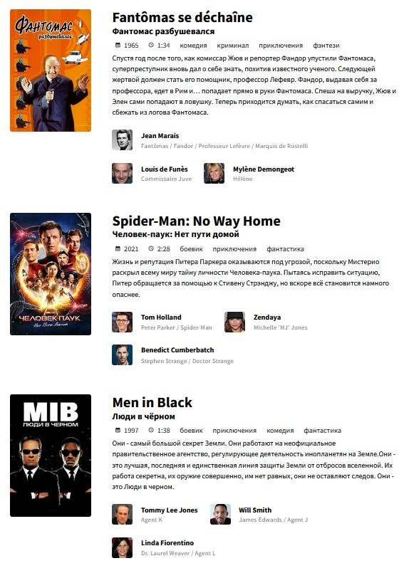

# KinoAfisha

> Vue + Vite + Quasar + TheMovieDB API

Enter 3 films and KinoAfisha will create a poster with them for printing on 1 sheet.

As simple as that:




## Install the dependencies

```bash
yarn
# or
npm install
```

### Start the app in development mode (hot-code reloading, error reporting, etc.)

```bash
quasar dev
```

### Lint the files

```bash
yarn lint
# or
npm run lint
```

### Format the files

```bash
yarn format
# or
npm run format
```

### Build the app for production

```bash
quasar build
```
